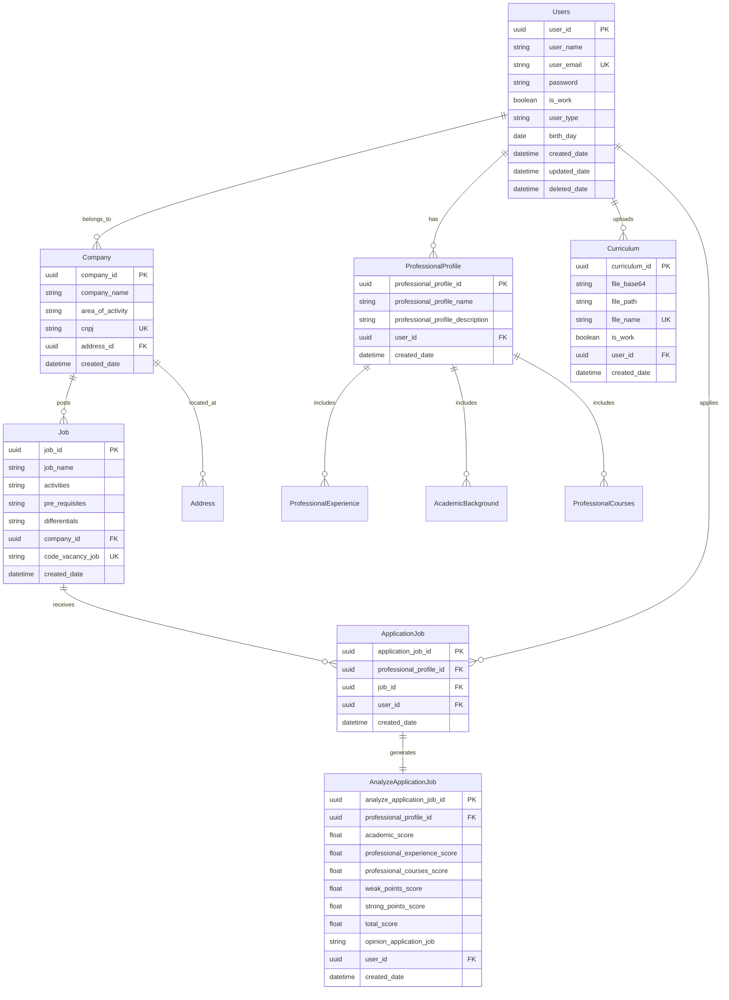
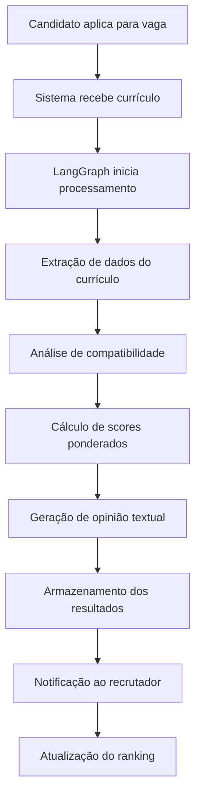
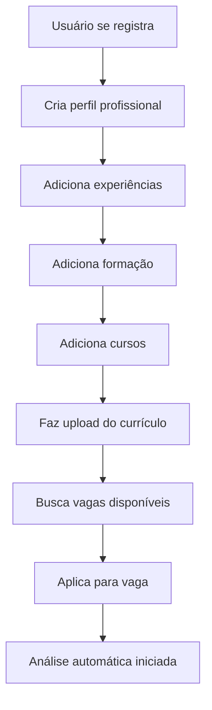

# 📚 Documentação Técnica - Sistema de Análise de Currículos com LLM

## 📋 Especificação de Requisitos

### 🎯 Objetivo
Este documento descreve os requisitos do sistema que realiza análise de currículos baseada em vagas de emprego, utilizando modelos de linguagem (LLM) e LangGraph.

### 🔍 Escopo
O sistema permite que recrutadores registrem vagas, enviem currículos e recebam análise automática que indica a compatibilidade de cada candidato.

### 👥 Usuários do Sistema
- **Recruiters**: Profissionais de RH responsáveis pelo recrutamento
- **HR Analysts**: Analistas que avaliam relatórios e métricas
- **Candidates**: Candidatos que se inscrevem para vagas
- **Company Owners**: Proprietários que gerenciam empresas

### 🛠️ Tecnologias
- **Backend**: LangGraph, LLM APIs (OpenAI, Anthropic, Groq, Gemini), PostgreSQL, Python
- **Frontend**: Tailwind CSS, TypeScript, Next.js
- **Infrastructure**: Node.js, NestJS, RabbitMQ, Docker

### 🚧 Restrições
- Acesso a APIs de LLM
- Limites de tokens
- Custos de API

## 📝 Casos de Uso

### UC01: Cadastro de Vaga
**Ator Principal:** Recruiter/HR Analyst  
**Objetivo:** Registrar nova vaga de emprego no sistema  
**Pré-condições:** Usuário autenticado e vinculado a empresa  

### UC02: Upload de Currículo
**Ator Principal:** Candidate  
**Objetivo:** Enviar currículo para análise  
**Pré-condições:** Candidato registrado no sistema  

### UC03: Análise de Currículo
**Ator Principal:** Sistema (LLM + LangGraph)  
**Objetivo:** Processar e analisar compatibilidade currículo-vaga  
**Trigger:** Upload de currículo ou aplicação para vaga  

### UC04: Visualização e Relatórios
**Ator Principal:** Recruiter/HR Analyst  
**Objetivo:** Visualizar rankings e relatórios de candidatos  
**Pré-condições:** Análises processadas disponíveis  

## ⚙️ Requisitos Funcionais

| ID | Descrição |
|---|---|
| **RF01** | O sistema deve permitir registro de vagas de emprego |
| **RF02** | O sistema deve permitir registro de usuários |
| **RF03** | O usuário deve poder criar perfil profissional |
| **RF04** | O usuário deve poder registrar experiência profissional, formação acadêmica e cursos |
| **RF05** | O sistema deve permitir candidatura a vagas |
| **RF06** | Usuários vinculados a empresas podem registrar vagas |
| **RF07** | O sistema deve permitir envio de currículos |
| **RF08** | O sistema deve processar currículos com LLM + LangGraph |
| **RF09** | O sistema deve realizar análise de compatibilidade perfil-vaga |
| **RF10** | O sistema deve gerar classificação de currículos por vaga |
| **RF11** | O sistema deve gerar relatórios em PDF |
| **RF12** | O sistema deve permitir visualização de resultados |
| **RF13** | O sistema deve permitir visualização por vaga e por usuário |

## 🔧 Requisitos Não-Funcionais

| ID | Categoria | Descrição |
|---|---|---|
| **RNF01** | Performance | Resposta dentro de 2 minutos |
| **RNF02** | Usabilidade | Interface responsiva |
| **RNF03** | Segurança | Garantir segurança dos dados (LGPD) |
| **RNF04** | Disponibilidade | Alta disponibilidade |
| **RNF05** | Escalabilidade | Capacidade de escalar |
| **RNF06** | Manutenibilidade | Arquitetura baseada em grafos (LangGraph) |

## 📐 Regras de Negócio

### Sistema de Pontuação

| ID | Regra | Peso |
|---|---|---|
| **BR01** | Avaliação de experiência profissional | 35% |
| **BR02** | Avaliação de formação acadêmica | 30% |
| **BR03** | Avaliação de cursos profissionalizantes | 20% |
| **BR04** | Avaliação de pontos fortes | 15% |
| **BR05** | Avaliação de pontos fracos | -10% |

### Fórmula de Cálculo
```
Score Final = (Experiência × 0.35) + (Formação × 0.30) + (Cursos × 0.20) + (Pontos Fortes × 0.15) - (Pontos Fracos × 0.10)
```

### Outras Regras

| ID | Descrição |
|---|---|
| **BR06** | Score final é a soma ponderada dos critérios |
| **BR07** | Usuário pode registrar dados sem perfil profissional completo |
| **BR08** | Usuário pode se candidatar apenas uma vez por vaga |

## 👤 User Stories

### Épico: Gestão de Candidatos

**US01: Registro de Candidato**
```
Como: usuário candidato
Eu quero: poder me registrar no sistema
Para: acessar o sistema
```

**US02: Criação de Perfil Profissional**
```
Como: usuário candidato
Eu quero: poder criar um perfil profissional
Para: atribuir experiência profissional, formação acadêmica e cursos
```

**US03: Registro de Experiências**
```
Como: usuário candidato
Eu quero: poder registrar experiência profissional, formação acadêmica e/ou cursos
Para: atribuir a um perfil profissional
```

### Épico: Gestão de Vagas e Recrutamento

**US04: Visualização de Rankings**
```
Como: usuário de recursos humanos
Eu quero: poder visualizar o ranking dos candidatos de uma vaga
Para: selecionar os candidatos compatíveis
```

**US05: Registro de Vagas**
```
Como: usuário de recursos humanos
Eu quero: poder registrar uma vaga de emprego
Para: que candidatos se candidatem
```

**US06: Gestão de Empresa**
```
Como: usuário owner
Eu quero: poder registrar uma empresa
Para: adicionar analistas de RH e vagas de emprego
```

## 🗄️ Modelo de Dados

### Diagrama Entidade-Relacionamento



### Entidades Detalhadas

#### 👤 Users (Usuários)
**Propósito:** Armazenar informações dos usuários do sistema  
**Campos Principais:** 
- `user_id` (PK): Identificador único
- `user_email` (UK): Email único para login
- `user_type`: Tipo de usuário (admin, recruiter, candidate)
- `is_work`: Indica se é usuário corporativo

#### 🏢 Company (Empresas)
**Propósito:** Informações das empresas que utilizam o sistema  
**Relacionamentos:** 
- Possui endereço (Address)
- Publica vagas (Job)
- Tem usuários vinculados

#### 💼 Job (Vagas)
**Propósito:** Vagas de emprego disponíveis  
**Campos Principais:**
- `activities`: Atividades da vaga
- `pre_requisites`: Pré-requisitos obrigatórios
- `differentials`: Diferenciais desejados

#### 📄 ProfessionalProfile (Perfil Profissional)
**Propósito:** Perfil profissional completo do candidato  
**Composição:**
- Experiências profissionais
- Formação acadêmica
- Cursos profissionalizantes

#### 📊 AnalyzeApplicationJob (Análise de Candidatura)
**Propósito:** Resultado da análise de IA  
**Scores Calculados:**
- Academic: 30%
- Professional Experience: 35% 
- Courses: 20%
- Strong Points: +15%
- Weak Points: -10%

## 🔄 Fluxos de Processo

### Fluxo de Análise de Currículo



### Fluxo de Cadastro e Candidatura



## 🧪 Cenários de Teste

### Cenários de Aceitação

#### Teste: Criação de Perfil Profissional
```gherkin
Dado que sou um candidato logado
Quando acesso a página de perfil profissional
E preencho nome e descrição
E clico em "Salvar"
Então o perfil deve ser criado com sucesso
E devo ver mensagem de confirmação
```

#### Teste: Análise de Currículo
```gherkin
Dado que uma vaga está cadastrada
E um candidato aplicou com currículo válido
Quando o sistema processa a análise
Então deve calcular scores para todas as categorias
E o score total deve estar entre 0 e 100
E deve gerar opinião textual explicativa
```

#### Teste: Ranking de Candidatos
```gherkin
Dado que múltiplos candidatos aplicaram para uma vaga
Quando acesso o painel de recrutador
Então devo ver lista ordenada por score total
E cada candidato deve mostrar score detalhado
E devo poder filtrar por critérios específicos
```

## 🔒 Considerações de Segurança

### Proteção de Dados (LGPD)
- Criptografia de senhas com bcrypt
- Dados sensíveis em transit e at rest
- Logs de auditoria para acesso a dados
- Consentimento explícito para processamento

### Autenticação e Autorização
- JWT tokens com expiração
- Roles baseados em permissões
- Rate limiting nas APIs
- Validação de entrada rigorosa

### APIs de LLM
- Chaves de API em variáveis de ambiente
- Timeout e retry para resiliência
- Sanitização de dados enviados
- Monitoramento de custos e uso

## 📈 Métricas e Monitoramento

### KPIs do Sistema
- Tempo médio de análise de currículo
- Taxa de precisão das análises
- Satisfação dos recrutadores
- Volume de candidaturas processadas

### Monitoring Técnico
- Latência das APIs de LLM
- Taxa de erro nas análises
- Uso de recursos (CPU, memória)
- Disponibilidade do sistema

## 🔄 Versionamento e Releases

### Estratégia de Versionamento
- **Semantic Versioning**: MAJOR.MINOR.PATCH
- **Feature Flags**: Para releases graduais
- **Blue-Green Deployment**: Para zero downtime

### Roadmap

#### v1.0 (MVP) - Q1 2025
- [x] Sistema de usuários e autenticação
- [x] Cadastro de empresas e vagas
- [ ] Upload e análise básica de currículos
- [ ] Interface de recrutador básica

#### v1.1 - Q2 2025
- [ ] Análise avançada com LangGraph
- [ ] Relatórios em PDF
- [ ] Dashboard de métricas
- [ ] API para integrações

#### v2.0 - Q3 2025
- [ ] IA explicável (XAI)
- [ ] Análise de viés e fairness
- [ ] Integração com ATS externos
- [ ] Mobile app

---

**Documento Versão:** 1.0  
**Última Atualização:** Janeiro 2025  
**Responsável Técnico:** Equipe de Desenvolvimento  
**Status:** 🟡 Em Desenvolvimento